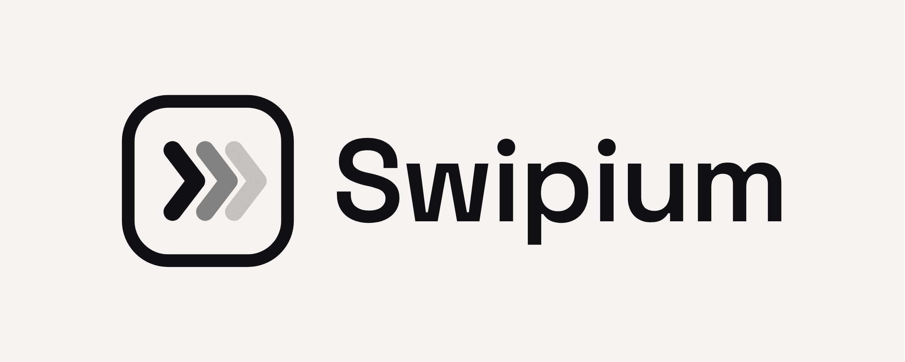

<p align="center">
  
</p>

# Swipium

MCP server for simulator-based mobile QA agents.

[](https://www.npmjs.com/package/swipium)
[](LICENSE)
[](https://nodejs.org)
[](https://modelcontextprotocol.io)
[](https://swipium.com)

Swipium lets an AI agent run practical mobile QA from a local MCP client: launch an app in an Android Emulator or iOS Simulator, inspect screens, act on the UI, run smoke checks, collect evidence, build an app knowledge map, generate reports, and create reusable test assets.

Website: [swipium.com](https://swipium.com)

## About

The goal of the MCP is to give your agent a ready-to-use suite of tools so it can test your application using an emulator and real user flows, not directly against the code, with the experience of a QA. Avoid reaching TestFlight or production only to find an error that could have been caught before making the build.

Focused on mobile applications, for now.

## What is Swipium?

Swipium is not a replacement for a test runner. It is an agent-facing QA harness.

It helps an agent answer requests like:

- "Test it."
- "Test this e2e flow."
- "Create test automation for this app."
- "Smoke test this app."
- "Explore the login flow."
- "Generate a report with evidence."
- "Turn this run into a reusable flow."
- "Create an automation suite from what you observed."

The MCP server keeps the workflow deterministic where possible and explicit where risk exists. Heavy steps such as booting simulators, installing apps, writing files, or generating automation are exposed as tools with structured outputs, blockers, artifacts, and consent prompts.

Swipium does not run on Appium. It drives devices directly via `adb`, `simctl`, and WebDriverAgent; Appium is one of the export formats for generated tests (`qa_generate` with `target:"appium"`), not the execution engine.

## QuickStart

Run this from the mobile app repository:

```bash
npx -y swipium verify
```

Add Swipium to your agent:

```bash
npm install -g swipium
swipium init claude --apply --scope project
```

Then ask the agent:

```text
Test this app with Swipium. Start with qa_test_this. Use Android Emulator or iOS Simulator only. Generate a report with evidence.
```

For a direct MCP configuration without a global install:

```jsonc
{
  "mcpServers": {
    "swipium": {
      "command": "npx",
      "args": ["-y", "swipium"],
      "cwd": "/absolute/path/to/your/mobile-app",
      "timeout": 600000
    }
  }
}
```

## Installation

Run without installing:

```bash
npx -y swipium verify
```

Install globally:

```bash
npm install -g swipium
swipium verify
```

Install in a project:

```bash
npm install --save-dev swipium
npx swipium verify
```

### Prerequisites

All platforms:

- Node.js 20 or newer.

Android:

- Android platform-tools with `adb` on your PATH (`ANDROID_HOME/platform-tools`), typically installed via Android Studio.
- The Android Emulator package and at least one AVD, or an emulator that is already online.
- An APK or buildable Android project. Java is only needed for build-from-source native Android builds.

iOS:

- Xcode with an iOS Simulator runtime and at least one simulator created.
- A simulator-ready app artifact, such as a simulator `.app`.
- For UI interaction (taps, typing, `qa_snapshot`): a WebDriverAgent build. Install `appium-webdriveragent`, or configure `ios.wda.derivedDataPath` / `wdaProjectPath`, then let `qa_wda` build and start it. `qa_doctor` with `platform:"ios"` checks for this.

#### iOS runs in two modes

- **Visual-only mode** (no WebDriverAgent): install, launch, deep links, screenshots, logs, and visual assertions work via `simctl`. UI-tree snapshots, taps, typing, and swipes are rejected with a clear error pointing to `qa_wda`.
- **Full-interaction mode** (WebDriverAgent built and running): structured snapshots and input work like on Android. Use `qa_wda` (doctor, build, start) or attach an external WDA URL.

Android has full interaction out of the box through `adb`; no extra agent is required.

## Usage

Start with the autopilot tool:

```text
qa_test_this {
  "projectRoot": "/absolute/path/to/app",
  "mode": "execute",
  "goal": "smoke"
}
```

Common workflow:

1. `qa_doctor` checks local toolchain readiness. Use `platform:"android"`, `platform:"ios"`, or `platform:"both"`.
2. `qa_test_this` resolves the project, artifact, and simulator target.
3. `qa_job_status` polls long-running work.
4. `qa_smoke` or `qa_explore` runs the app.
5. `qa_report` produces the evidence report, including separate app and coverage verdicts.
6. `qa_app_map_read` or `qa_app_map_query` reads the durable app map.
7. `qa_generate` creates reusable QA assets from the run (`target`: flow, page objects, POM suite, test cases, or Appium code).

CLI helpers:

```bash
swipium verify                 # starts the server and checks tool injection
swipium init claude            # preview Claude Code registration
swipium init gemini            # preview Gemini registration
swipium init codex             # preview Codex config
swipium init flows             # create starter flow templates
swipium scan                   # scan project context
swipium suite                  # local suite helper
```

Note: `swipium verify` only reports pass/fail for server start and tool injection. Actionable fix hints — install steps for platform-tools, Xcode, WebDriverAgent, `brew install` suggestions — come from the `qa_doctor` tool output inside your MCP client, not from `swipium verify`.

## MCP Server

Swipium runs as a stdio MCP server. MCP clients launch it as a local process and communicate through JSON-RPC over stdin and stdout.

Manual MCP configuration:

```jsonc
{
  "mcpServers": {
    "swipium": {
      "command": "npx",
      "args": ["-y", "swipium"],
      "cwd": "/absolute/path/to/your/mobile-app",
      "timeout": 600000
    }
  }
}
```

Installed binary configuration:

```jsonc
{
  "mcpServers": {
    "swipium": {
      "command": "swipium",
      "args": [],
      "cwd": "/absolute/path/to/your/mobile-app",
      "timeout": 600000
    }
  }
}
```

`npx -y swipium` is the canonical setup for npm users. If you run from a source checkout instead, build first with `npm run build` and use `node /absolute/path/to/swipium/dist/index.js` as the command.

Important:

- Set `cwd` to the mobile app repository.
- Restart the MCP client after installing or upgrading.
- Run `qa_doctor` if tools are missing or stale.
- Use `qa_get_artifact` for report, screenshot, dump, and log artifacts.

More detail: [docs/mcp-server.md](docs/mcp-server.md)

## Agent Integration

### Claude Code

Global install:

```bash
npm install -g swipium
swipium init claude --apply --scope project
```

No global install:

```bash
claude mcp add swipium --scope project -- npx -y swipium
```

### Gemini CLI

Global install:

```bash
npm install -g swipium
swipium init gemini --apply
```

No global install:

```bash
gemini mcp add swipium npx -y swipium
```

### Codex

Global install:

```bash
npm install -g swipium
swipium init codex --apply
```

Manual Codex config:

```toml
[mcp_servers.swipium]
command = "npx"
args = ["-y", "swipium"]
cwd = "/absolute/path/to/your/mobile-app"
```

Known caveat: Codex builds after ~0.120.0 have an open tool-injection regression (openai/codex#19425). Set `cwd` explicitly, and if `qa_*` tools do not appear after setup, switch `command` to an absolute path (the installed `swipium` binary, or `node <abs>/dist/index.js` from a source checkout) and restart Codex.

### Claude Desktop

Add to `claude_desktop_config.json` (macOS: `~/Library/Application Support/Claude/claude_desktop_config.json`), then restart Claude Desktop:

```jsonc
{
  "mcpServers": {
    "swipium": {
      "command": "npx",
      "args": ["-y", "swipium"],
      "cwd": "/absolute/path/to/your/mobile-app",
      "timeout": 600000
    }
  }
}
```

### Cursor

Add to `.cursor/mcp.json` in the mobile app repository (or `~/.cursor/mcp.json` for all projects):

```jsonc
{
  "mcpServers": {
    "swipium": {
      "command": "npx",
      "args": ["-y", "swipium"],
      "cwd": "/absolute/path/to/your/mobile-app",
      "timeout": 600000
    }
  }
}
```

After setup, verify that the client lists `qa_test_this`, `qa_capabilities`, and `qa_report`.

## Tool Docs

Swipium exposes 60 public MCP tools. Start with `qa_test_this` for low-context requests.

Full reference: [docs/tools.md](docs/tools.md)

New in 1.5.0 — production consolidation:

- **60 public tools** — the MCP surface is smaller and clearer, with lower-level helpers merged into canonical workflows or deferred out of the public contract.
- **`qa_generate`** — one entry point for flow YAML, page objects, per-run suites, test-case docs, and Appium code.
- **`qa_first_run`** — one safe first-run tool for login, signup, onboarding, permissions, OTP, paywall, and home-screen transitions.
- **Release hardening** — clean builds, lint/format/test/audit/pack release checks, structured `failureCode` errors, and safer local file locking.

Earlier releases added device-parity, local-first visual, seeded-state, report-history (1.1.0); durable issue memory, persistent test suite, flow plan/repair, agent helpers (1.2.0); feature-focused testing plus local build/artifact resolution (1.3.0); and app-map/agent helper refinements (1.4.0). The 1.5.0 release consolidates those capabilities into the production public surface — see the CHANGELOG for migration notes.

| Group | Tools |
| --- | --- |
| Start | `qa_agent_brief`, `qa_capabilities`, `qa_test_this`, `qa_job_status`, `qa_job_cancel`, `qa_status`, `qa_explain_blocker`, `qa_continue_from_blocker`, `qa_next_best_action`, `qa_get_artifact` |
| Setup | `qa_doctor`, `qa_start_session`, `qa_detect_context`, `qa_plan`, `qa_prepare_target`, `qa_prepare_ios_target`, `qa_ios`, `qa_wda` |
| Build | `qa_resolve_target`, `qa_resolve_artifact`, `qa_build`, `qa_bundletool` |
| Device | `qa_device_info`, `qa_orientation`, `qa_geolocation`, `qa_network`, `qa_metro`, `qa_app_control`, `qa_screen_record` |
| Drive | `qa_snapshot`, `qa_inspect`, `qa_act`, `qa_clear_overlay`, `qa_check_health`, `qa_screenshot`, `qa_note`, `qa_assert_visual`, `qa_wait` |
| Run | `qa_smoke`, `qa_explore`, `qa_report` |
| App map | `qa_app_map_build`, `qa_app_map_read`, `qa_app_map_query`, `qa_app_map_update`, `qa_app_map_feature_scope` |
| Feature | `qa_test_feature` |
| Flows | `qa_flow_check`, `qa_flow_run`, `qa_flow_compile`, `qa_flow_repair` |
| Generate | `qa_generate` |
| Test suite | `qa_suite_read`, `qa_suite_update`, `qa_suite_generate`, `qa_suite_export`, `qa_suite_lint` |
| Issues | `qa_issue_log`, `qa_mobile_audit` |
| First run | `qa_first_run` |

## Why Swipium?

- Agent-native: exposes QA work as MCP tools with structured outputs.
- Simulator-first: focuses on Android Emulator and iOS Simulator reliability.
- Evidence-first: screenshots, logs, reports, dumps, and artifacts are stored and linked.
- App memory: the app map preserves screens, features, test cases, flows, and coverage context.
- Practical consent: mutating actions are gated instead of hidden behind agent text.
- Reusable output: exploratory runs can become flows, test cases, suites, and generated automation.
- Local by default: the server runs on the developer machine and uses local simulators.

## Security

Swipium runs locally as a stdio process: no network listener, no remote service. Destructive actions are consent-gated server-side, and known secret shapes are redacted from snapshots, artifacts, and reports. Trust boundaries, threats, and controls are documented in the [Threat Model](THREAT_MODEL.md). Report vulnerabilities per the [Security Policy](SECURITY.md).

## Docs

- [MCP Server](docs/mcp-server.md)
- [Tool Reference](docs/tools.md)
- [Project Docs Index](docs/README.md)
- [Threat Model](THREAT_MODEL.md)
- [Security Policy](SECURITY.md)
- [Contributing](CONTRIBUTING.md)
- [Support](SUPPORT.md)
- [Changelog](CHANGELOG.md)

## License

MIT. See [LICENSE](LICENSE).
