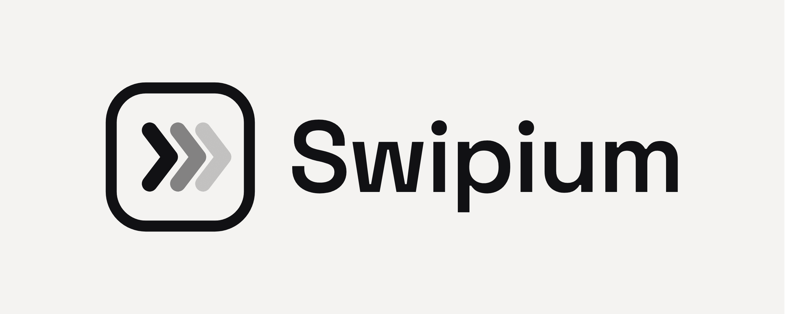

<p align="center">
  
</p>

# Swipium

An MCP server that lets coding agents QA mobile apps on Android Emulators and iOS Simulators.

[](https://www.npmjs.com/package/swipium)
[](LICENSE)
[](https://nodejs.org)
[](https://modelcontextprotocol.io)
[](https://swipium.com)

Swipium gives an AI coding agent (Claude Code, Codex, Gemini CLI, Cursor, VS Code, and other MCP clients) the tools a QA engineer uses: find or build the app, boot a simulator, install and launch it, read the screen, tap and type through real user flows, and write a report backed by screenshots, logs, and UI dumps. A run can be turned into a repeatable flow, a test suite, or Appium code.

It is for mobile developers who want their agent to catch the broken login screen before a TestFlight or Play Console build. It runs locally (stdio, no network listener), drives devices through `adb`, `simctl`, and WebDriverAgent rather than Appium, and asks your consent before anything with side effects. [swipium.com](https://swipium.com)

### A session, abbreviated

```text
You:    Smoke test this app on Android with Swipium.
Agent > qa_test_this { goal: "smoke" }                       (mode defaults to "plan": nothing runs)
        plan for ~/code/shop-app (framework=react-native, session 3f9c2a1b)
        target: android (will boot Pixel_8_API_35)
        artifact: APK android/app/build/outputs/apk/release/app-release.apk
          1. [ ] qa_prepare_target: Install + launch   2. [ ] qa_smoke   3. [ ] qa_report
Agent > qa_test_this { sessionId: "3f9c2a1b", mode: "execute", goal: "smoke" }
        🔐 Consent required (low): • boot_emulator: emulator -avd Pixel_8_API_35 -no-window
                                   • install_apk: adb install -r -g android/app/.../app-release.apk
You:    Approve                                               (one prompt covers boot + install)
        state: "running", jobId: "a41c09e2"
Agent > qa_job_status { sessionId: "3f9c2a1b", jobId: "a41c09e2", waitMs: 45000 }
        status: "done", result.state: "completed"
        reportSummary: "PASS app · COVERED coverage · PASS tool. Read swipium://session/3f9c2a1b/report/…"
Agent:  The app launched and passed the smoke checks with no crashes or error screens.
```

The report behind that summary, rendered with `npx swipium report --latest --format markdown`, includes:

```markdown
**Release risk: 🟢 SHIP**

**App status:** PASS - No high-severity app/native finding observed in this run.
**Coverage status:** COVERED - Structured smoke/workflow evidence was collected.
**Tool status:** PASS - No Swipium/MCP limitations or tool errors recorded in this run.
```

## Contents

[Requirements](#requirements) · [Quickstart](#quickstart) · [Starter prompts](#starter-prompts) · [How it works](#how-it-works) · [Tools](#tools) · [Where results go](#where-results-go) · [Configuration](#configuration--environment-variables) · [CLI](#cli-reference) · [CI](#ci) · [Upgrading](#upgrading) · [Troubleshooting](#troubleshooting) · [Security](#security)

## Requirements

**Node.js 20 or newer.** Swipium works with emulators and simulators only; physical devices are refused with `PHYSICAL_DEVICE_UNSUPPORTED` ([why](docs/physical-devices.md)).

**MCP:** a stdio server that speaks protocol revisions 2025-06-18, 2025-11-25 and 2026-07-28; the client's first message picks one. Claude Code 2.1.285 and later connect on 2026-07-28, Codex 0.146 on 2025-06-18. Any stdio MCP client should work ([protocol versions](docs/mcp-server.md#protocol-versions)).

| Host | Android Emulator | iOS Simulator |
| --- | --- | --- |
| macOS | Supported | Supported (Xcode with a Simulator runtime) |
| Linux | Supported | Not available |
| Windows | Experimental and untested; some process-cleanup helpers rely on `ps` | Not available |

| Your app | What Swipium needs |
| --- | --- |
| React Native / Expo, debug build | Metro serving the JS bundle. `qa_metro` can start it (consent-gated); otherwise the run stops with `METRO_REQUIRED`. |
| React Native / Expo release, or native Android / iOS | An installable artifact (APK or `.aab` for Android, a simulator `.app` for iOS; a device `.ipa` is refused) or a project Swipium can build. |
| Expo managed (no `android/` or `ios/`) | Run `npx expo prebuild` first. Without native directories the build fails with `EXPO_PREBUILD_REQUIRED`. |
| Flutter | A buildable Flutter project, or a built APK / `.app`. |

- **Android:** platform-tools, the Emulator, and at least one AVD (usually via Android Studio). `adb` on your `PATH` is used if present, else the SDK copy from `$ANDROID_HOME`, `$ANDROID_SDK_ROOT`, or the default SDK location (`~/Library/Android/sdk`, `~/Android/Sdk`, `%LOCALAPPDATA%\Android\Sdk`). The `emulator` binary that boots AVDs and `aapt2` come from the SDK first. `.aab` files need bundletool.
- **iOS (macOS only):** Xcode and a simulator. Taps, typing, and UI-tree snapshots need **WebDriverAgent** (WDA, the on-simulator automation server Appium uses); without it iOS is visual-only ([iOS modes](docs/concepts.md#ios-modes)).

## Quickstart

**1. Register Swipium with your client.** From your app repository, for Claude Code:

```bash
npx -y swipium init claude --scope project           # preview; changes nothing
npx -y swipium init claude --scope project --apply   # writes .mcp.json, then runs `swipium verify`
```

The same command handles `codex`, `gemini`, `cursor`, and `vscode` (`swipium init <client> --apply`). Claude Desktop, Windsurf, manual configs, and per-client details are in **[docs/mcp-server.md](docs/mcp-server.md)**.

**Codex:** `swipium init codex --apply` appends a `[mcp_servers.swipium]` block to `~/.codex/config.toml` (or `$CODEX_HOME/config.toml`) with longer timeouts and an `env_vars` line. Codex doesn't pass your shell environment to MCP servers, so without that line `SWIPIUM_TEST_*`, `ANDROID_HOME` and `JAVA_HOME` never reach Swipium. If you already have a block, `init` prints the line to add. Keep `tool_timeout_sec = 600` ([Codex setup](docs/mcp-server.md#codex)).

**Headless runs** (`codex exec`, `claude -p`, CI): these clients answer consent prompts automatically, so nothing gated (boot, install, build) runs unless you pre-approve exact actions with `SWIPIUM_CONSENT_PREAPPROVE` in the server env ([Headless runs](docs/mcp-server.md#headless-runs)).

**2. Restart the client** and check that it lists `qa_test_this`, `qa_doctor`, and `qa_report`.

**3. Ask the agent to test the app:**

```text
Use Swipium to smoke test this app. Run qa_doctor, then qa_test_this with
mode "execute" and goal "smoke", poll qa_job_status until the job finishes,
and summarize the report.
```

`mode:"execute"` matters: the default `mode:"plan"` has no side effects and only returns what would happen. `goal:"smoke"` is the fastest path. With no `goal`, `qa_test_this` runs the smoke check and then tries to generate a test suite.

If a tool returns `PROJECT_ROOT_UNRESOLVED`, name the absolute project path in your prompt or set `SWIPIUM_PROJECT_ROOT` in the server config ([Project root](docs/concepts.md#project-root)).

### What you'll see

- **One approval prompt** listing the exact build, boot, and install commands. Clients with MCP elicitation show a real prompt; others return `requiresConsent`, which the agent must relay to you.
- **The first build can take minutes.** The run is a background job the agent polls with `qa_job_status` (each poll waits up to about 45 s).
- **Two states.** The job `status` is `running`, `done`, `failed`, or `cancelled`. The run's `result.state` is `completed` or `needs_input` (job `done`), or `blocked` or `unsafe` (job `failed`). `needs_input` means one question for you, such as login credentials.
- **A report** with separate verdicts for the app, coverage, and Swipium itself. Read it with `npx swipium report --latest --format markdown`.

## Starter prompts

| Goal | Prompt |
| --- | --- |
| Smoke test | "Use Swipium to smoke test this app: qa_test_this mode execute, goal smoke, then summarize the report." |
| Test login | "Use Swipium to test login with goal test_login. Don't ask me for the password: type `${SWIPIUM_TEST_EMAIL}` and `${SWIPIUM_TEST_PASSWORD}` with qa_act." (set both in the server `env`; placeholders expand server-side and secret values are redacted) |
| Reproduce a bug | "Use Swipium to reproduce this bug with goal reproduce_bug and goalText: 'checkout button does nothing after adding a coupon'. Attach the evidence." |
| Save a flow | "Turn the last Swipium run into a flow named login-smoke with qa_generate and save it." |
| Release gate | "Run Swipium with goal release_gate and tell me whether the release gate passes." |

Clients that support MCP prompts can use the built-in ones instead: `swipium_setup_check`, `swipium_guardrail_validation`, `swipium_full_smoke`, `swipium_bug_repro`, and `swipium_convert_run_to_flow`.

## How it works

```text
qa_test_this {mode:"plan"}  >  qa_test_this {mode:"execute"}  >  consent  >  job
                                                                               │
                         qa_job_status {waitMs} <──────────────────────────────┘
                           ├─ completed / blocked / unsafe  >  report (qa_get_artifact reportUri)
                           └─ needs_input  >  ask you one question  >  qa_continue_from_blocker
```

`qa_test_this` finds or builds the app, boots a simulator, installs and launches the app, runs a smoke check (plus exploration or suite generation, per `goal`), and always writes a report. Failures carry a `failureCode` that `qa_explain_blocker` explains. For hands-on work the agent opens a session (`qa_start_session`), reads the screen with `qa_snapshot`, and acts on element refs such as `@e3`.

Concepts, explained in **[docs/concepts.md](docs/concepts.md)**:

- **[Project root](docs/concepts.md#project-root):** the repository under test, from the `projectRoot` argument, MCP roots, `SWIPIUM_PROJECT_ROOT`, `CLAUDE_PROJECT_DIR`, or the server's working directory.
- **[Consent](docs/concepts.md#consent):** builds, boots, installs, data wipes, network changes, and repo-supplied commands need your single-use approval.
- **[Sessions and jobs](docs/concepts.md#sessions-and-jobs):** a session holds one run's device, app, and evidence; long work is a job you poll.
- **[Secrets and redaction](docs/concepts.md#secrets-and-redaction):** credentials are redacted from text output; screenshots are not.
- **[iOS modes](docs/concepts.md#ios-modes):** visual-only through `simctl`, or full interaction with WDA.
- The **app map** is Swipium's durable memory of your app's screens; a **flow** is a replayable YAML script ([docs/flows.md](docs/flows.md)); a **POM suite** is a generated page-object test suite. See the [glossary](docs/concepts.md#glossary).

## Tools

Grouped by capability (`qa_status` without arguments returns the same groups). Every tool's parameters and behavior are in **[docs/tools.md](docs/tools.md)**; `swipium verify` lists what your installed version exposes.

| Group | Tools |
| --- | --- |
| Start | `qa_test_this`, `qa_status`, `qa_job_status`, `qa_job_cancel`, `qa_explain_blocker`, `qa_continue_from_blocker`, `qa_get_artifact` |
| Setup | `qa_doctor`, `qa_start_session`, `qa_prepare_target`, `qa_prepare_ios_target`, `qa_ios`, `qa_wda` |
| Build | `qa_resolve_target`, `qa_resolve_artifact`, `qa_build`, `qa_bundletool` |
| Device | `qa_device_info`, `qa_orientation`, `qa_geolocation`, `qa_network`, `qa_metro`, `qa_app_control`, `qa_screen_record` |
| Drive | `qa_snapshot`, `qa_inspect`, `qa_act`, `qa_clear_overlay`, `qa_check_health`, `qa_screenshot`, `qa_note`, `qa_visual`, `qa_wait` |
| Run | `qa_smoke`, `qa_explore`, `qa_report` |
| App map | `qa_app_map_build`, `qa_app_map_read`, `qa_app_map_query`, `qa_app_map_feature_scope`, `qa_app_map_update` |
| Feature | `qa_test_feature` |
| Flows | `qa_flow_check`, `qa_flow_run`, `qa_flow_compile`, `qa_flow_repair` |
| Generate | `qa_generate` |
| Test suite | `qa_suite_read`, `qa_suite_update`, `qa_suite_generate`, `qa_suite_export`, `qa_suite_lint` |
| Issues | `qa_issue_log`, `qa_mobile_audit` |
| First run | `qa_first_run` |

Every tool carries MCP annotations: read-only tools declare `readOnlyHint:true` and `openWorldHint:false` (so clients can auto-approve them); the rest also declare `destructiveHint` and `idempotentHint`.

## Where results go

- **`<your repo>/.swipium/`:** app map, flows, test suite, issue ledger, visual baselines, generated files, and your configuration (`config.json`, `fixtures.json`, `policy.json`). The first time Swipium writes the app map or issue ledger in a Git repository, it adds `.swipium/` to `.gitignore`. Never pruned automatically.
- **`~/.swipium/runs/`:** per-session state and evidence (screenshots, logs, UI dumps, reports), returned as `swipium://` URIs. When a server process first loads its session registry, it prunes in the background session directories older than `SWIPIUM_RETENTION_DAYS`, keeping registered sessions and the newest `SWIPIUM_RETENTION_KEEP` per project. `swipium gc` cleans up on demand.

## Configuration & environment variables

Set these in the MCP server's `env` block (or your shell, for CLI commands). This is the complete list of variables Swipium reads.

**Codex** forwards only the names listed in `env_vars` (plus a fixed whitelist such as `HOME` and `PATH`); `swipium init codex` writes that line for you. It deliberately leaves out `CLAUDE_PROJECT_DIR`, `SWIPIUM_DISABLE_DEVICE_DISCOVERY` and the approval grants (`SWIPIUM_CONSENT_PREAPPROVE`, `SWIPIUM_CONSENT_PREAPPROVE_RUN_CODE`, `SWIPIUM_ALLOW_REMOTE_WDA`): set those literally in `env = { ... }` so an inherited shell export or a direnv file in a cloned repo can't grant approvals. Add your own custom `SWIPIUM_*` flow variables to the list. Details: [docs/mcp-server.md](docs/mcp-server.md#codex).

| Variable | Purpose |
| --- | --- |
| `SWIPIUM_PROJECT_ROOT` | Absolute path of the app repository when the client provides no MCP roots. |
| `CLAUDE_PROJECT_DIR` | Set by Claude Code; used as the project root after `SWIPIUM_PROJECT_ROOT`. |
| `ANDROID_HOME`, `ANDROID_SDK_ROOT` | Android SDK location, searched for `adb`, `emulator`, and `aapt2` (see [Requirements](#requirements)). |
| `BUNDLETOOL_JAR` | Path to `bundletool.jar` for converting `.aab` files. A `bundletool` launcher on `PATH` also works. |
| `DEVELOPMENT_TEAM`, `XCODE_DEVELOPMENT_TEAM` | Apple team ID for signing WDA (`ios.wda.developmentTeam` in `.swipium/config.json` takes precedence). |
| `APPIUM_HOME` | Extra location searched for an Appium-installed WDA (besides `~/.appium` and global npm). |
| `WDA_PROJECT_PATH`, `WEBDRIVERAGENT_PROJECT` | Extra `WebDriverAgent.xcodeproj` candidates reported by `qa_doctor` and `qa_wda` status (to build one, pass `wdaProjectPath`). |
| `SWIPIUM_ALLOW_REMOTE_WDA` | Comma-separated exact non-loopback WDA base URLs you pre-approve. Set it in your client config, never in the repository. |
| `SWIPIUM_TEST_*` | Test-account values: `_EMAIL`, `_USERNAME`, `_PASSWORD`, `_OTP`, `_TOKEN`, `_PIN` (and `_DEEP_LINK` for the starter flows). Flows and `qa_act` use `${SWIPIUM_TEST_EMAIL}`; `fixtures.json` uses `"var": "SWIPIUM_TEST_EMAIL"`. |
| Other `SWIPIUM_*` | Flows and fixtures read **only** `SWIPIUM_*` names from the environment (never `${HOME}` or `${AWS_SECRET_ACCESS_KEY}`). Names containing `pass`, `secret`, `token`, `otp`, `pin`, `cvv`, `key`, or `code` are secrets and redacted. |
| `SWIPIUM_OCR_CMD` | OCR command for `qa_visual` `find_text` (none bundled; consent-gated). `{image}` becomes a PNG path; it prints `[{"text","confidence","bbox"}]` JSON. `ocrCommand` in `config.json` wins. |
| `SWIPIUM_VISUAL_MASK_CMD` | Masks screenshots before OCR and visual providers see them (`visualMaskCommand` in config wins). |
| `SWIPIUM_REQUIRE_ELICITATION=1` | Refuse every consent-gated action (`CONSENT_REFUSED`) when the client can't show a real consent prompt. Operator pre-approval still applies. |
| `SWIPIUM_CONSENT_PREAPPROVE` | Comma-separated exact consent action names approved without a prompt (for example `prepare_plan,test_this_plan`), for headless clients such as `codex exec` or `claude -p` that answer prompts automatically. No wildcards; unknown names are ignored with a warning. Actions that run code also need `SWIPIUM_CONSENT_PREAPPROVE_RUN_CODE=1`, and `wda_non_loopback` is never accepted (use `SWIPIUM_ALLOW_REMOTE_WDA`). Read only from the server process env, never the repository. Each approval is still single-use and is logged at `warn` with the exact command. See [Operator pre-approval](docs/concepts.md#operator-pre-approval). |
| `SWIPIUM_CONSENT_PREAPPROVE_RUN_CODE` | `1` lets `SWIPIUM_CONSENT_PREAPPROVE` cover actions that run repository- or model-chosen code (`build_from_source`, `flow_mutation_run`, `ocr_run`, `seed_state`, `start_metro`, `suite_fresh_state_replay`, `wda_build`, `wda_start`, and a `test_this_plan` that includes a build). Under `codex exec` that code runs outside the client's sandbox. Trusted repositories only. |
| `SWIPIUM_RETENTION_DAYS` | Age limit in days for `~/.swipium/runs` session directories (default 30). `0` or `off` disables the automatic prune; `swipium gc` still works. |
| `SWIPIUM_RETENTION_KEEP` | Number of newest sessions per project always kept (default 20). |
| `SWIPIUM_LOG_LEVEL` | Minimum stderr log level: `debug`, `info` (default), `warn`, or `error`. `debug` adds one line per tool call (tool, session, duration, error code; never argument values). |
| `JAVA_HOME` | JDK used by Gradle builds; `qa_doctor` flags a missing JDK under Codex. |
| `CODEX_HOME` | Where `swipium init codex` finds `config.toml` (default `~/.codex`). |
| `CI` | When set, reports label the run environment as CI. |
| `GITHUB_SHA`, `GITHUB_REF_NAME`, `GITHUB_SERVER_URL`, `GITHUB_REPOSITORY`, `GITHUB_RUN_ID`, `CI_COMMIT_SHA`, `CI_COMMIT_REF_NAME`, `CI_PIPELINE_URL`, `BITBUCKET_COMMIT`, `BITBUCKET_BRANCH` | Source revision (commit, branch, run URL) recorded in reports and the issue ledger. |
| `SWIPIUM_DISABLE_DEVICE_DISCOVERY` | Test-suite isolation only: disables device auto-discovery. Not for normal use. |

Generated flows, suites, and code never contain credential values; they reference `SWIPIUM_TEST_*`, `SWIPIUM_SECRET_N`, or `SWIPIUM_GEN_<FIELD>`, which you set when replaying. Generated Appium projects read their own variables (`SWIPIUM_PLATFORM`, `APPIUM_HOST`, `ANDROID_*`, `IOS_*`, …), documented in their README.

## CLI reference

With no subcommand, `swipium` runs the stdio MCP server (what clients launch). `swipium --help` prints this list.

| Command | What it does |
| --- | --- |
| `swipium` (alias `swipium serve`) | Start the stdio MCP server. Unrecognized flags alone (such as `--stdio`) are ignored with a warning; an unknown subcommand prints usage and exits 2. |
| `swipium init <client> [--apply] [--scope local\|user\|project] [--cwd <dir>]` | Preview (default) or apply the registration for `claude`, `codex`, `gemini`, `cursor`, or `vscode`. See [docs/mcp-server.md](docs/mcp-server.md). |
| `swipium init flows [--root <dir>] [--force]` | Write starter flow templates into `.swipium/flows/` (existing files kept unless `--force`). |
| `swipium verify` | Start the server over stdio, check that every tool is listed, and run `qa_doctor`. |
| `swipium scan [path] [--check \| --dry-run \| --no-write]` | Print a readiness report. Creates `.swipium/` unless the result is `BLOCKED` or a no-write flag is set. |
| `swipium suite <lint\|compile\|init> [projectRoot] [--suite <file>]` | `lint` flags brittle page-object locators, `compile` turns a POM suite into flows under `.swipium/flows/`, `init` explains suites. |
| `swipium report --format junit\|sarif\|github-summary\|markdown\|json` | Render a saved report (`--latest` default, `--session`, `--report`, `--root`, `--out`, `--fail-on-gate`). Exits 1 when the gate blocks with `--fail-on-gate`, 2 on usage error or no report. |
| `swipium gc [--dry-run] [--days N] [--keep N]` | Delete old `~/.swipium/runs` session directories and stale `~/.swipium/projects.json` entries. |
| `swipium --help` / `-h`, `--version` / `-v` | Print usage or the version. |

## CI

`swipium report` renders a finished run as JUnit, SARIF, a GitHub job summary, Markdown, or JSON; `--fail-on-gate` fails the job when the `.swipium/policy.json` release gate blocks. The CLI does not drive devices: CI still needs an agent (such as `claude -p`) calling the MCP tools, including `qa_flow_run` to replay saved flows. Nobody answers consent prompts in CI, so either install the app in the workflow before the agent step (safest) or [pre-approve](docs/ci-reports.md#pre-approving-consents-in-ci) the exact actions the agent needs. Recipe: **[docs/ci-reports.md](docs/ci-reports.md)**.

## Upgrading

Restart your MCP client after every upgrade; a client still running the old server gets `STALE_CLIENT` errors.

- **From 2.0.x to 2.2.0:** element lists in `structuredContent` are now `@eN` strings (pass `responseMode:"verbose"` for objects), Codex needs the `env_vars` line, `qa_wda build` returns a job, and waits end within about 50 s. See the [2.2.0 upgrade checklist](CHANGELOG.md#220---2026-10-05).
- **From 1.5.x:** 2.0 removed and renamed tools, reads only `SWIPIUM_*` variables in flows and fixtures, and asks consent for every install. Work through the [2.0.0 upgrade checklist](CHANGELOG.md#200---2026-09-30) and the [migration table](CHANGELOG.md#migrating-from-150) first, then the 2.2.0 one.

## Troubleshooting

Every error has a `failureCode`, `nextSteps`, and `retrySafe`. `qa_explain_blocker` explains any code, `qa_doctor` checks the toolchain, and the full catalog is in [docs/tools.md](docs/tools.md#failure-codes).

| `failureCode` | Meaning | What to do |
| --- | --- | --- |
| `PROJECT_ROOT_UNRESOLVED` | Swipium can't tell which app to test. | Name the absolute path in the prompt or set `SWIPIUM_PROJECT_ROOT` ([project root](docs/concepts.md#project-root)). |
| `STALE_CLIENT` | The client runs a pre-upgrade server or uses a removed tool. | Restart the MCP client. |
| `ADB_NOT_FOUND` | Android platform-tools can't be found. | Install them via Android Studio; set `ANDROID_HOME` in the server `env` for GUI clients or non-default locations. |
| `NO_DEVICE` | No emulator is online and none can be booted. | Create an AVD or iOS Simulator; `qa_test_this` boots it for you. |
| `PHYSICAL_DEVICE_UNSUPPORTED` | Only a real phone is available. | Start an emulator, or unplug the phone. |
| `METRO_REQUIRED` | A debug RN/Expo build needs Metro serving. | Start Metro (`qa_metro {action:"start"}` or `npx react-native start` / `npx expo start`), then retry. |
| `EXPO_PREBUILD_REQUIRED` | The Expo project has no native directories. | Run `npx expo prebuild`, then retry. |
| `WDA_UNREACHABLE` | WebDriverAgent isn't running or answering. | `qa_wda {action:"status"}`, then `start` or `attach`. For a plain smoke check, use `goal:"smoke"`, which works visual-only. |
| `BACKEND_UNSUPPORTED` | The action needs WDA (iOS visual-only mode). | Attach WDA with `qa_wda`, or use `qa_visual` and `qa_screenshot`. |
| `CONSENT_DECLINED` / `CONSENT_CANCELLED` / `CONSENT_REFUSED` | Nothing ran: you declined, the prompt was dismissed, timed out or failed (`elicitationFailure` says why), or `SWIPIUM_REQUIRE_ELICITATION=1` blocked it. | Re-call for a fresh prompt if you want the action. `likelyAutomatic: true` means a headless client answered in under 1.5 s: don't loop, pre-approve the named `action` with `SWIPIUM_CONSENT_PREAPPROVE` ([Headless runs](docs/mcp-server.md#headless-runs)). |
| `CANCELLED` | The call or job was cancelled. Not a failure, never recorded as a finding. | Re-call if you still want it. Cancelling a call doesn't stop a background job; `qa_job_cancel` does. |
| `INVALID_ARGUMENT` | An undeclared, missing, or wrong-typed argument, or an unknown `sessionId`, `jobId` or artifact URI. Nothing ran. | Fix the argument; the result lists `acceptedParameters`. Over-large `waitMs` / `timeoutMs` values are clamped to 50000 with a note, not rejected. |

If tool calls time out in the client, raise its tool timeout (Codex `tool_timeout_sec = 600`): waits and job polls end within about 50 s, but a few synchronous steps, such as an iOS Simulator cold boot, can take longer.

## Security

Swipium is a local stdio process with no network listener. Actions with side effects need your [consent](docs/concepts.md#consent); each approval is single-use and bound to its session, and only the server's own environment can pre-approve actions (`SWIPIUM_CONSENT_PREAPPROVE`), never a repository file or the model. Known secret values are [redacted](docs/concepts.md#secrets-and-redaction) from snapshots, artifacts, and reports, and generated output is checked for leaked secrets. A cloned repository's `.swipium/` is treated as untrusted: repo-supplied commands are shown verbatim in the consent prompt, flows read only `SWIPIUM_*` variables, and Swipium never runs `git`. Screenshots are never redacted, so use `qa_start_session { sensitive: true }` to refuse all screen captures when that matters. Details: [Threat Model](THREAT_MODEL.md). Report vulnerabilities privately per the [Security Policy](SECURITY.md).

## Contributing and license

See [CONTRIBUTING.md](CONTRIBUTING.md), [SUPPORT.md](SUPPORT.md), the [docs index](docs/README.md), and the [CHANGELOG](CHANGELOG.md). MIT licensed; see [LICENSE](LICENSE).
